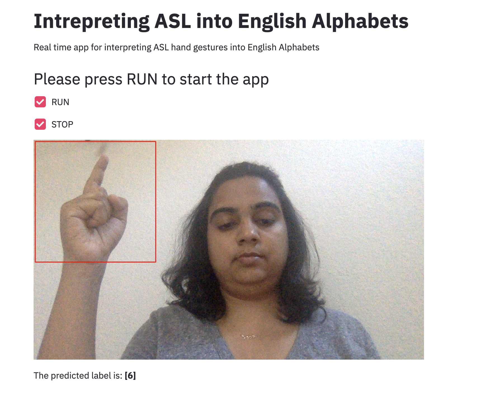

# Interpreting Sign Language using Neural Networks

[American Sign Language/ASL](https://www.nidcd.nih.gov/health/american-sign-language) is a primary means of communication for deaf, hard of hearing and hearing nonverbal children who are nonverbal due to conditions such as down syndrome, autism and other speech disorders. Currently, there is a shortage of interpreters in the US and the U.S. Bureau of Labor Statistics estimates a rise of 19% ASL interpreter by 2028.

The aim of this project was to interprete signs from hand images of ASL into English alphabets using neural networks. Data is downloaded from [Kaggle](https://www.kaggle.com/datamunge/sign-language-mnist) as a CSV file and consists of image information for each alphabet 

An accuracy of 0.97 was obtained using convolutional neural network was obtained. Transfer learning was attempted which could not outperform CNN. 

# Workflow

1. [EDA & Logistic Regression](https://github.com/PrasunaM/ASL_Interpreter-MetisDeepLearning/blob/4efd4bb3bda230d3f02aab0432c6f4f231ce646c/Final_submission/ASL_EDA_&_Logistic%20Regression.ipynb)
2. [Convolution Neural Network](https://github.com/PrasunaM/ASL_Interpreter-MetisDeepLearning/blob/ab04efab1260288aee97849a23ace3a158841051/Final_submission/ASL_CNN.ipynb) 
3. [Attempt with Transfer Learning](https://github.com/PrasunaM/ASL_Interpreter-MetisDeepLearning/blob/ef5e15a2fc2860e85d8f86a124d376cbcf0b59a4/Final_submission/ASL_CNN_TransferLearning.ipynb) 
4. [Presentation Slides](Final_submission/DeepLearningSlides.pdf)

# Conclusion

Best accuracy was obtained using CNN with 5 conv2D layers and 3 dense layers. Overfitting was addressed with drop out, batch normalization and early stopping. 
Attempt for a better accuracy will be made in the future with more image data. 

# Future Work

App is in process that can predict sign language alphabets in realtime. 

 

